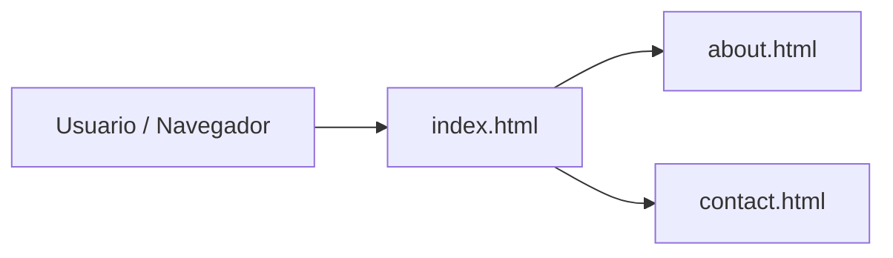
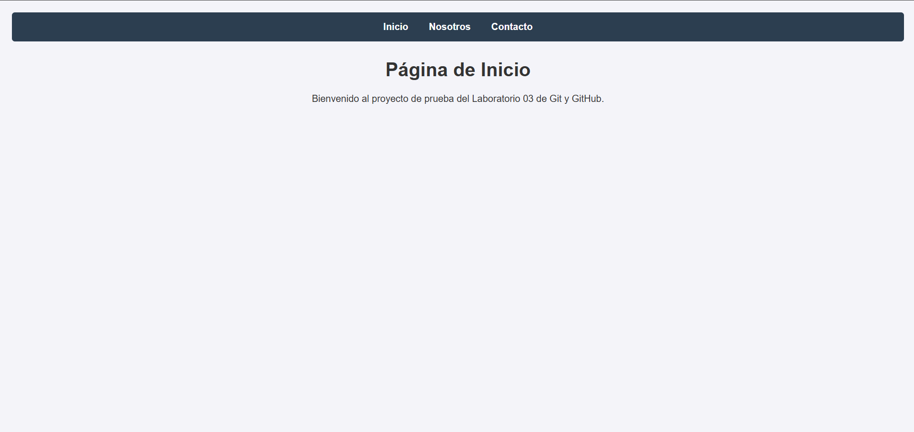
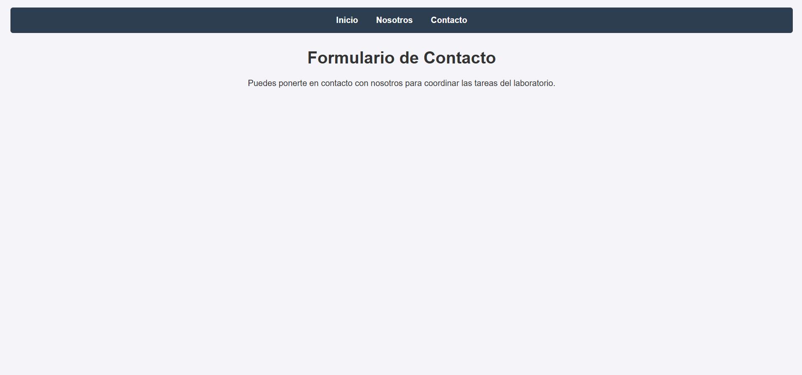

# 🌐 MiPagina


Sitio web estático de práctica con múltiples páginas (inicio, acerca de y contacto), desarrollado como proyecto colaborativo en el curso de Diseño y Desarrollo de Software (C24) — Tecsup.

---

## 📑 Tabla de Contenidos

- [Descripción](#descripción)
- [Tecnologías utilizadas](#tecnologías-utilizadas)
- [Estado del proyecto](#estado-del-proyecto)
- [Arquitectura](#arquitectura)
- [Estructura de archivos](#estructura-de-archivos)
- [Uso](#uso)
- [Capturas de pantalla](#capturas-de-pantalla)
- [Contribuidores](#contribuidores)
- [Licencia](#licencia)

---

## Descripción

**MiPagina** es un sitio web de varias páginas construido con HTML. Incluye una página principal (`index.html`), una sección "Acerca de" (`about.html`) y una sección de contacto (`contact.html`). El proyecto se trabajó de forma colaborativa usando ramas y Pull Requests en GitHub.

---

## Tecnologías utilizadas

| Tecnología | Uso principal              | Versión |
|:-----------|:----------------------------|:-------:|
| HTML       | Estructura de las páginas    | 5       |
| CSS        | Estilos visuales             | 3       |
| Git/GitHub | Control de versiones         | -       |

---

## Estado del proyecto

- [x] Crear estructura inicial del proyecto (`index`, `about`, `contact`)
- [x] Configurar el repositorio en GitHub
- [x] Trabajo colaborativo con Pull Requests (footer e index)
- [ ] Agregar estilos CSS responsivos
- [ ] Agregar formulario funcional en contacto
- [ ] Desplegar el sitio (GitHub Pages)

---

## Arquitectura



---

## Estructura de archivos

```
MiPagina/
├── index.html      # Página principal
├── about.html      # Página "Acerca de"
└── contact.html    # Página de contacto
```

## Uso

```bash
# Clonar el repositorio
git clone https://github.com/raylaberry-code/MiPagina.git

# Entrar a la carpeta
cd MiPagina

# Abrir index.html en el navegador
```

---

## Capturas de pantalla

| Página principal | Página de contacto |
|:---:|:---:|
|  |  |

---

## Contribuidores

| Nombre | Rol | GitHub |
|:-------|:----|:-------|
| Raylaberry | Desarrollo y estructura del sitio | [@raylaberry-code](https://github.com/raylaberry-code) |

---

## Licencia

Este proyecto está bajo la licencia MIT. Consulta el archivo `LICENSE` para más detalles.
